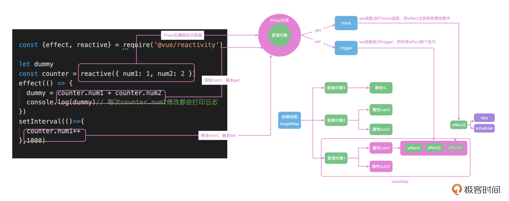

# 响应式原理

在读取数据的时候通过 track 收集函数的依赖关系，把整个对象和 effect 注册函数的依赖关系全部存储在一个依赖图中



effect 中获取 counter.num1 和 counter.num2 的时候，就会触发 counter 的 get 拦截函数；get 函数，会把当前的 effect 函数注册到一个全局的依赖地图中去。这样 counter.num1 在修改的时候，就会触发 set 拦截函数，去依赖地图中找到注册的 effect 函数，然后执行

## reactive

reactive 是通过 ES6 中的 Proxy 特性实现的属性拦截，所以，在 reactive 函数中我们直接返回 newProxy 即可

reactive 会对对象的每一key都进行监听

## mutableHandles

处理Proxy的get与set
1. get 中直接返回读取的数据，并且返回值是对象的话，还会嵌套执行 reactive，并且调用 track 函数收集依赖
2. set 中调用 trigger 函数，执行 track 收集的依赖

## track

在 track 函数中，我们可以使用一个巨大的 tragetMap 去存储依赖关系

map 的 key 是我们要代理的 target 对象，值还是一个 depsMap

收集嵌套的格式为

```
WeackMap<Map<string,Set>>
```

1. WeackMap的key为target
2. Map的key为key
3. Set存储当前的activeEffect

## trigger

trigger 函数实现的思路就是从 targetMap 中，根据 target 和 key 找到对应的依赖函数集合 deps，然后遍历 deps 执行依赖函数

## effect

fn 函数通过 effectFn 函数包裹执行，在 effectFn 函数内部，把函数赋值给全局变量 activeEffect；然后执行 fn() 的时候，就会触发响应式对象的 get 函数，get 函数内部就会把 activeEffect 存储到依赖地图中，完成依赖的收集

通过传递 lazy 和 scheduler 来控制函数执行的时机，默认是同步执行

## ref

ref只会对对象进行监听，即value

ref 的执行逻辑要比 reactive 要简单一些，不需要使用 Proxy 代理语法，直接使用对象语法的 getter 和 setter 配置，监听 value 属性即可

ref 也可以包裹复杂的数据结构，内部会直接调用 reactive 来实现

## computed

我们拦截 computed 的 value 属性，并且定制了 effect 的 lazy 和 scheduler 配置，computed 注册的函数就不会直接执行，而是要通过 scheduler 函数中对 _dirty 属性决定是否执行
